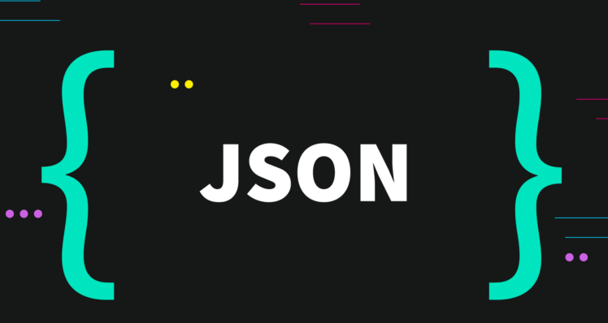
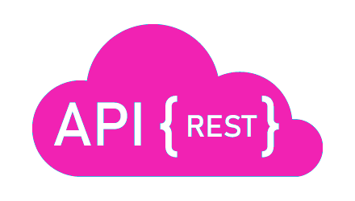

<h2 align="center"> Hi, I'm Haroon Ahmad 👋   </h2>

 <samp>Currently Im studying Web development. I want to be at the bleeding edge of technology. 📚📈🔬, and I'm also a competitive programmer 🤩 🎈. I like solving Puzzles, problems. I like helping newbies (like myself) because it basically helps me improve my own knowledge by a great extent. 
  
  
## Languages I speak and Things I love:

<table>
<tbody>
<tr>

<td align="center" width="20%">
<b>
Javascript ES6
</b> 

</td>

<td align="center" width="20%">
<b>
ReactJS
</b> 
 
</td>

<td align="center" width="20%">
<b>
Redux
</b> 

</td>

<td align="center" width="20%">
<b>
jQuery
</b> 
 
</td>

</tr>

<tr>
<td align="center" width="20%">
<b>
NodeJS
</b> 
 
</td>

<td align="center" width="20%">
<b>
ExpressJS
</b> 
 
</td>

<td align="center" width="20%">
<b>
MongoDB
</b> 
 
</td>

</tr>

<tr>

<td align="center" width="20%">
<b>
PHP
</b> 

</td>

<td align="center" width="20%">
<b>
mySQL
</b> 

</td>

<td align="center" width="20%">
<b>
Laravel
</b> 
 
</td>

</tr>
<tr>

<td align="center" width="20%">
<b>
JSON
</b> 

</td>

<td align="center" width="20%">
<b>
REST APIs
</b> 

</td>

<td align="center" width="20%">
<b>
JEST
</b> 

</td>

</tr>

<tr>
<td align="center" width="20%">
<b>
CSS
</b> 

</td>

<td align="center" width="20%">
<b>
HTML
</b> 

</td>

<td align="center" width="20%">
<b>
SAAS
</b> 

</td>

<td align="center" width="20%">
<b>
Bootstrap
</b> 

</td>

</tr>
</tbody>
</table>
---

<h3 align="center"> Other Accounts 📫 </h3>
 

